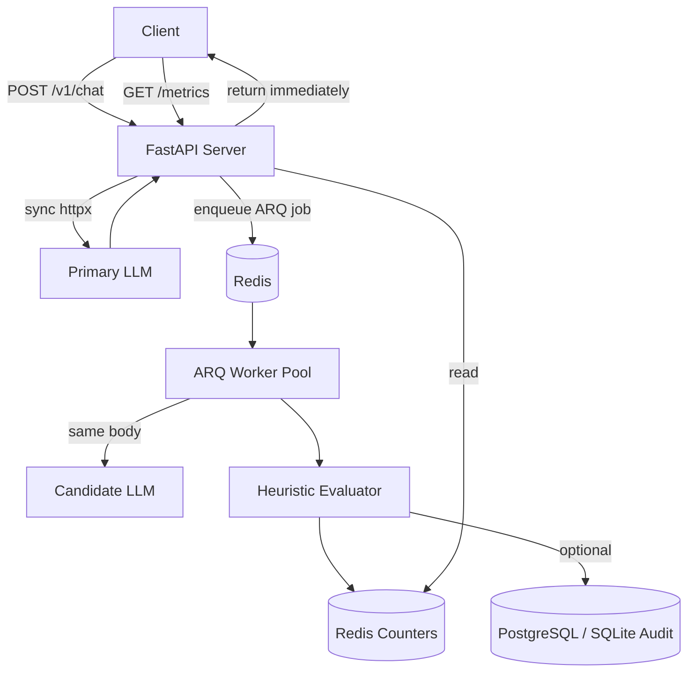

# Architecture

## System overview

## DigitalOcean deployment

- **App Platform Web** — `uvicorn app.main:app`
- **App Platform Worker** — `arq worker.main.WorkerSettings`
- **Managed Redis** — queue + metrics
- **Managed PostgreSQL** — production audit log

## Database strategy

| Environment | Driver | ORM URL |
|-------------|--------|---------|
| Local | SQLite | `sqlite+aiosqlite:///./data/shadow_evaluator.db` |
| Production | PostgreSQL | `postgresql+asyncpg://...` |

Tables created via SQLAlchemy `Base.metadata.create_all` (run migrations script).
