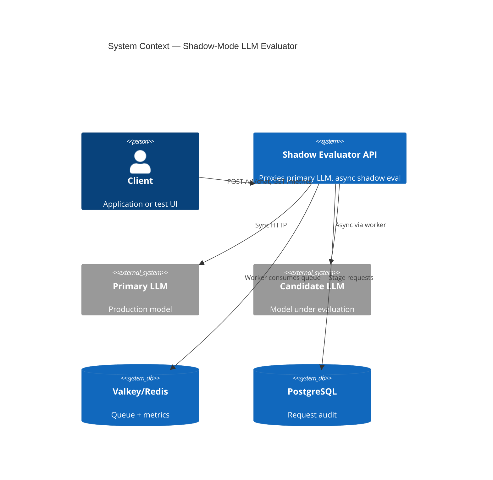
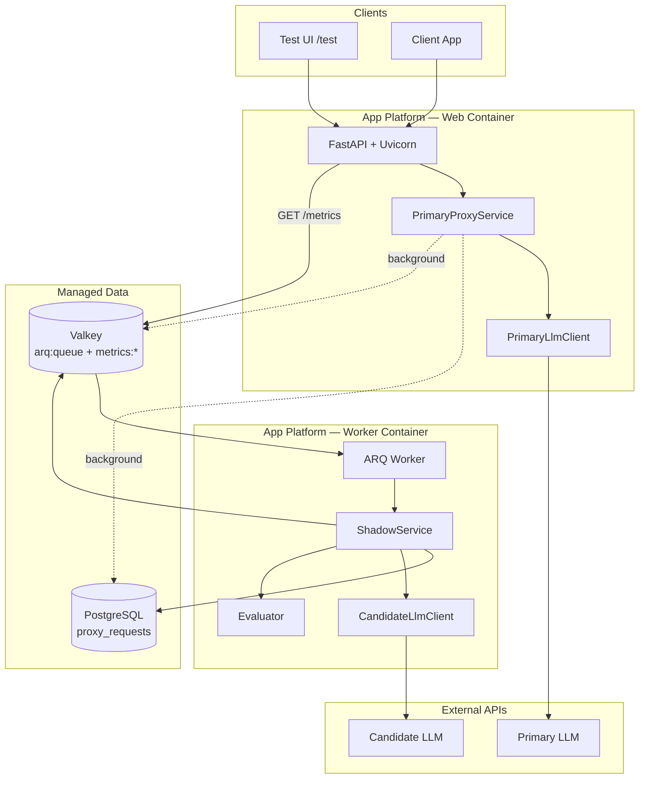
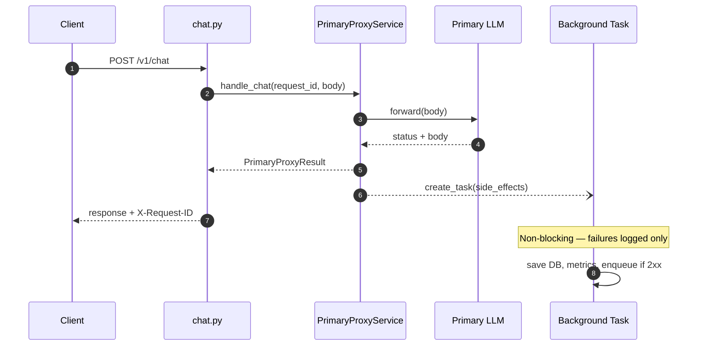
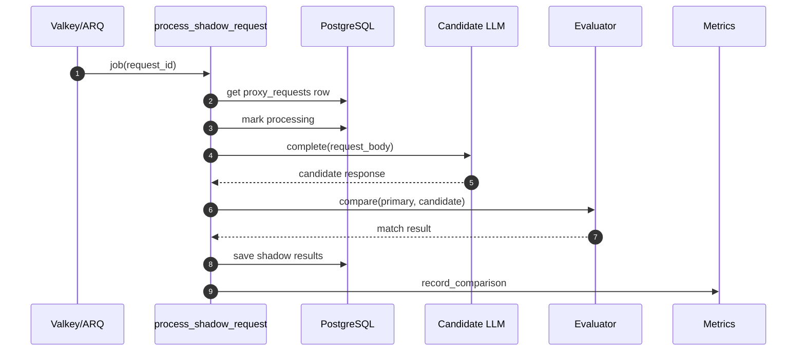

# Architecture

## 1. System Context

---

## 2. Container Diagram

---

## 3. Primary Request Flow

---

## 4. Shadow Worker Flow

**Order matters:** Candidate LLM is called **before** the evaluator runs.

---

## 5. Component Responsibilities

| Component | Process | Responsibility |
|-----------|---------|----------------|
| `app/api/routes/chat.py` | Web | HTTP in/out for `/v1/chat` |
| `PrimaryProxyService` | Web | Primary call + schedule side-effects |
| `PrimaryLlmClient` | Web | httpx forward to upstream |
| `ShadowQueue` | Web (BG) | ARQ enqueue + load shedding |
| `MetricsStore` | Web + Worker | Redis counters |
| `ShadowService` | Worker | Full shadow job lifecycle |
| `CandidateLlmClient` | Worker | httpx to candidate model |
| `evaluator/` | Worker | JSON + action extraction/match |

---

## 6. Infrastructure (Production)

| Resource | DigitalOcean Product | Purpose |
|----------|---------------------|---------|
| Web service | App Platform | `uvicorn app.main:app --host 0.0.0.0 --port 8080` |
| Worker | App Platform | `arq worker.main.WorkerSettings` |
| Database | Managed PostgreSQL | `proxy_requests` table |
| Cache/Queue | Managed Valkey | ARQ queue + live metrics |
| LLM | Serverless Inference | Primary + candidate models |

### Environment split

| Variable | Web | Worker |
|----------|-----|--------|
| `DATABASE_URL` | ✅ | ✅ |
| `REDIS_URL` | ✅ | ✅ |
| `PRIMARY_LLM_*` | ✅ | ✅ (worker may reuse for config) |
| `CANDIDATE_LLM_*` | optional | ✅ |
| `PORT` | ✅ | — |

---

## 7. Database Strategy

| Environment | Driver | Connection |
|-------------|--------|------------|
| Local dev | SQLite | `sqlite+aiosqlite:///./data/shadow_evaluator.db` |
| Production | PostgreSQL | `postgresql+asyncpg://...` with SSL |

Schema bootstrapped via `init_db()` on startup (`Base.metadata.create_all`).

**What goes where:** PostgreSQL stores per-request audit (`proxy_requests`); Valkey/Redis stores the ARQ queue and live metrics counters. See [DATA.md](DATA.md) for full schema and write timeline.

---

## 8. Observability

| Signal | Where |
|--------|-------|
| Structured logs | stdout → App Platform Runtime Logs |
| Live metrics | `GET /metrics` (Redis counters) |
| Health | `GET /health` |
| Request tracing | `X-Request-ID` on every chat response |

Log format: `timestamp LEVEL [module] message` with `request_id=` in key paths.
