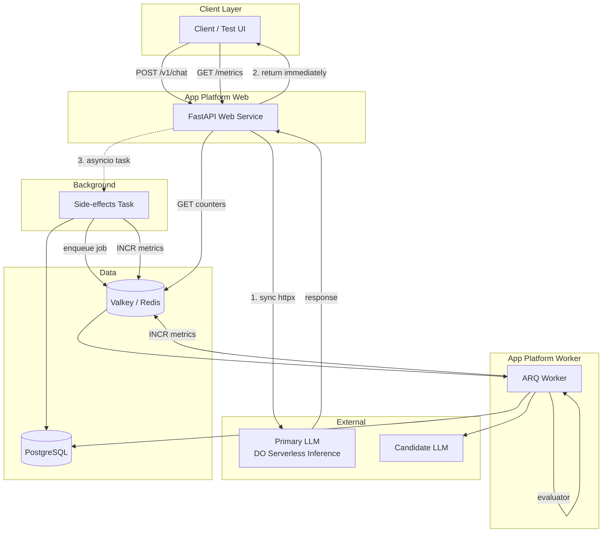
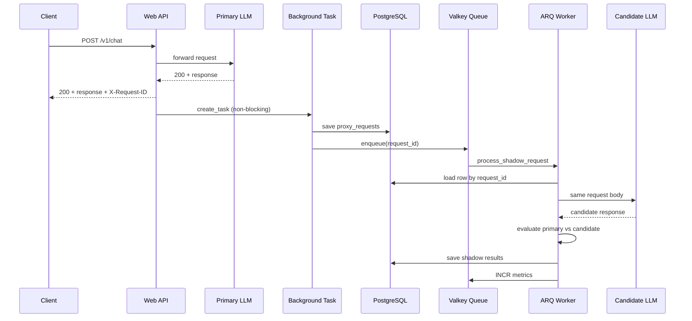
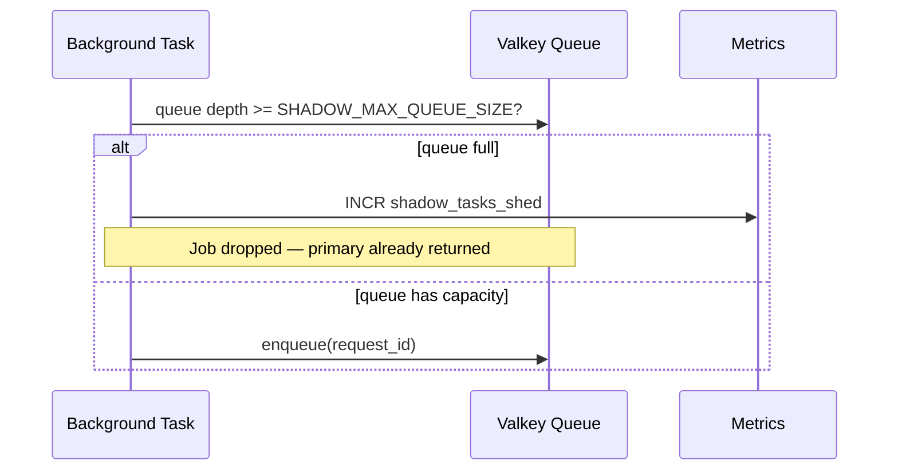
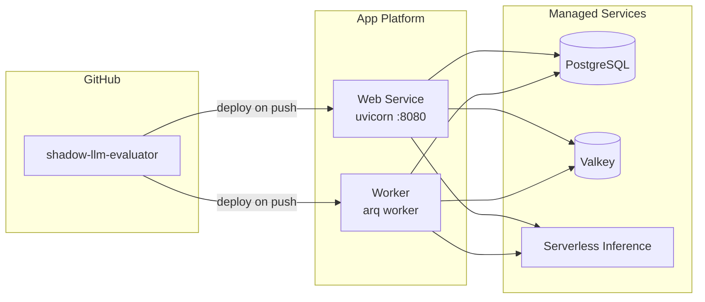

# Shadow-Mode LLM Evaluator — Design Document

> **Purpose:** Production API proxy that serves live traffic through a **primary LLM** while **asynchronously** evaluating a **candidate LLM** using simple heuristics, without blocking users.

---

## 1. Problem Statement

Teams upgrading or replacing an LLM need to compare a **candidate model** against the **production model** on real traffic. Calling both models synchronously doubles latency and couples user experience to experimental infrastructure.

**Goal:** Proxy customer requests to the primary model immediately, copy the same request to a candidate in the background, score the pair, and expose live metrics — with bounded resources under load.

---

## 2. Requirements

### Functional

| ID | Requirement |
|----|-------------|
| F1 | `POST /v1/chat` returns the **primary LLM response only** (sync) |
| F2 | Same request is routed to a **candidate LLM asynchronously** |
| F3 | Compare responses: valid JSON + exact `{ "action": "..." }` match |
| F4 | `GET /metrics` exposes real-time counters and match rate |
| F5 | Primary path must **not fail** due to shadow/DB/metrics failures |

### Non-functional

| ID | Requirement |
|----|-------------|
| NF1 | **Bounded concurrency** on shadow jobs (`SHADOW_MAX_CONCURRENCY`) |
| NF2 | **Load shedding** when queue is full (`SHADOW_MAX_QUEUE_SIZE`) |
| NF3 | Unit + integration tests, CI on every push |
| NF4 | Deployable on DigitalOcean App Platform (web + worker) |
| NF5 | Structured logging with `request_id` for debugging |

---

## 3. Architecture Overview

---

## 4. Core Design Principle: Two Paths

### Sync path (user-facing)

1. Receive `POST /v1/chat`
2. Generate server-side `request_id` (UUID)
3. Call **primary LLM** via httpx
4. **Return** upstream status + body immediately
5. Attach `X-Request-ID` header

**Critical rule:** DB writes, metrics, and shadow enqueue run in a **background asyncio task**. Failures there are logged only — they never change the HTTP response the user already received.

### Async path (shadow evaluation)

Runs only when primary returns **HTTP 2xx**:

1. Persist row in `proxy_requests` (`shadow_status=pending`)
2. Enqueue ARQ job `{ request_id }` if queue depth < limit
3. Worker loads row, calls **candidate LLM** with same `request_body`
4. Run evaluator on primary + candidate responses
5. Update row + increment Redis metrics

If primary returns 4xx/5xx, **no shadow job** is enqueued.

---

## 5. Sequence Diagrams

### 5.1 Happy path — chat request

### 5.2 Load shedding

---

## 6. Evaluation Heuristics

Both models are expected to return chat-completion JSON. The evaluator extracts JSON from `choices[0].message.content`.

| Step | Check |
|------|-------|
| 1 | Parse primary/candidate content as JSON |
| 2 | Require string field `action` |
| 3 | **Exact match:** `primary_action == candidate_action` |

**Metrics impact:**

- `comparisons_completed` — incremented when evaluation finishes
- `exact_match_count` — incremented only on exact match
- `exact_match_rate` — `exact_match_count / comparisons_completed`

---

## 7. Load Control

| Mechanism | Config | Behavior |
|-----------|--------|----------|
| **Load shedding** | `SHADOW_MAX_QUEUE_SIZE` (default 500) | Drop enqueue when queue full; increment `shadow_tasks_shed` |
| **Bounded concurrency** | `SHADOW_MAX_CONCURRENCY` (default 50) | ARQ worker `max_jobs` — limits parallel candidate calls |

Shed jobs are **intentionally not retried** — shadow eval is best-effort under spike load.

---

## 8. Data Model

**Full schema, column-level write paths, and Redis key reference:** [docs/DATA.md](DATA.md)

| Store | Holds | Why |
|-------|-------|-----|
| **PostgreSQL** | `proxy_requests` — full request + primary + shadow results | Durable audit; worker loads body by `request_id` |
| **Valkey/Redis** | ARQ queue (`arq:queue`) + live counters (`metrics:*`) | Fast enqueue; sub-ms `/metrics` reads |

**Not in Redis:** request/response bodies (Postgres only). **Not in Postgres:** queue depth or aggregated counters.

---

## 9. Technology Choices

| Decision | Choice | Rationale |
|----------|--------|-----------|
| API framework | **FastAPI** | Async-native, OpenAPI, fast to ship |
| Job queue | **ARQ + Valkey/Redis** | Lightweight async Python queue; Redis protocol compatible with DO Valkey |
| ORM | **SQLAlchemy 2 async** | SQLite locally, Postgres in prod |
| Primary HTTP | **httpx** | Async upstream calls with timeouts |
| Config | **Pydantic Settings** | Typed env vars, `.env` support |
| Deploy | **DO App Platform** | Managed web + worker, Postgres, Valkey |

---

## 10. Failure Handling

| Failure | User impact | System behavior |
|---------|-------------|-----------------|
| Primary timeout | 504 `PRIMARY_TIMEOUT` | No shadow job |
| Primary unreachable | 502 `PRIMARY_UNAVAILABLE` | No shadow job |
| Primary 4xx/5xx | Passthrough upstream body | No shadow job |
| DB save fails (background) | **None** — user got primary response | Logged |
| Valkey down (background) | **None** | Logged; metrics/shadow skipped |
| Queue full | **None** | Shed; `shadow_tasks_shed++` |
| Candidate fails | **None** | `shadow_execution_errors++`; row marked failed |

---

## 11. Security & Operations

- API keys stored in environment variables (never in repo)
- Server generates `request_id` — client-supplied IDs rejected (PK collision risk)
- Logs include `request_id`, status, latency — **not** request bodies or keys
- Postgres: SSL required for DO managed DB (`sslmode=require` handled in app)
- Valkey: TLS URI (`rediss://`) in production

---

## 12. Deployment Topology (DigitalOcean)

**Live example:** `https://sea-lion-app-l24ve.ondigitalocean.app`

---

## 13. Testing Strategy

| Layer | Coverage |
|-------|----------|
| Unit | Evaluator, primary client, proxy service, Postgres URL normalization |
| Integration | Chat proxy, shadow async flow, metrics, health, test UI |
| CI | `pytest` + `ruff` on every push (GitHub Actions) |
| Manual | Test UI at `/test`, smoke script, live curl |

---

## 14. Trade-offs & Future Work

| Decision | Trade-off |
|----------|-----------|
| Background side-effects | Eventual consistency for metrics/DB; simpler user contract |
| Exact action match only | Simple but misses semantic similarity |
| Load shedding vs backpressure | Protects primary; loses some shadow samples under spike |
| No Alembic migrations | `create_all` + SQLite column migration for dev simplicity |

**Possible extensions:** semantic similarity scoring, dead-letter queue for shed jobs, Prometheus export, rate limiting on `/v1/chat`.

---

## 15. Key Code References

| Component | Location |
|-----------|----------|
| Primary proxy + background task | `app/proxy/primary_proxy_service.py` |
| Shadow orchestration | `app/shadow/shadow_service.py` |
| Queue + shedding | `app/queue/shadow_queue.py` |
| Evaluator | `app/evaluator/` |
| Metrics | `app/metrics/` |
| Worker entry | `worker/main.py` |
